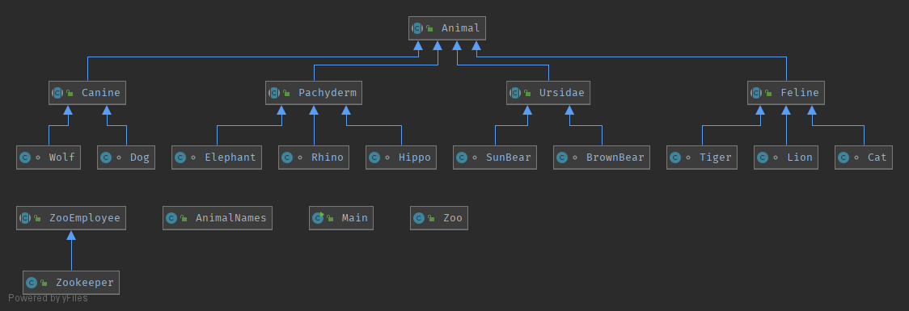
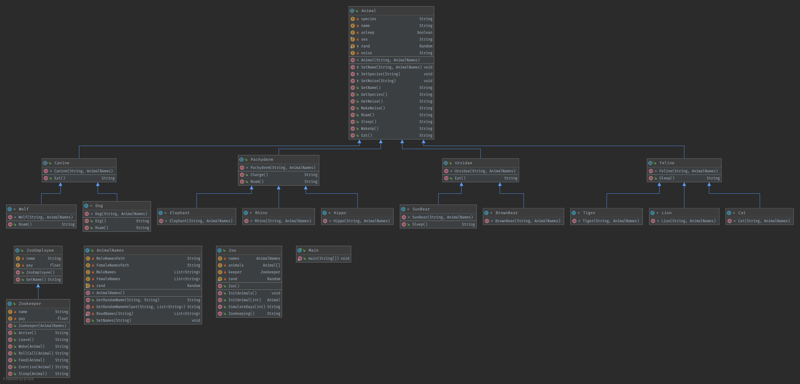

# Zoo Simulator
### **By Willie Chew and Sricharan Reddy Varra**

# Goal of program/Comments and Assumptions
Zoo Simulator is supposed to simulate the happening of a zoo. The zoo is home to a animals that range from 10 different species and belong to 4 different families (Pachyderm, Feline, Canine, Ursidae). Each species' count in the zoo ranges from 2 to 5 animals. A data set of baby names is used to find an appropriate name for each animal that corresponds with their species <sup>[1]</sup>. A zoo keeper arrives at the zoo everyday and does zoo keeping tasks. All actions of the zoo keeper and reactions from the animals were recorded via text and outputted to the *dayatthezoo.out* file. 

# Issues Encountered
When developing this program, the only real issue encountered was developing the program in Java. Our team had little prior knowledge and experience with Java and a few hours were spent understanding Java syntax, arrays, file i/o, and inheritance subtleties. Other than some basic problems, like array indexing, there was a very interesting problem that we had when it came to using a random variable that was inherited. We had to call it using a ```super.rand()``` command instead of a ```this.rand()```. That one took a while to figure out.

# Running the program
Using a code runner, we recommend IntelleJ, navigate to the *Project 1/* directory and build the project. Once built, run the *main.java*. If using IntelleJ, this can be accomplished by finding it in the file explorer in IntelleJ and right clicking it. A run option should then be offered.

# What's with that miscellaneous Python file?
That python file is only to aggregate all of the names proved by [1] into two files for unique male names, and unique female names. It does not run during the execution of the Java program, and has no other effects. It is just there to make loading in the names very straightforward (only 2 csv files, instead of 100+ txt files in ```/data/```).

# UML
We decided that it would be a better idea to construct the UML diagram of the assignment before starting the code using Lucidchart as students get free accounts through your education email. It helped us quite a lot!





* [Our UML diagram](Project%201%20UML.pdf)
* [IntelliJ's UML Diagram](UML-1.pdf)
* [IntelliJ's UML Diagram 2](UML-2.pdf)

# References
<sup>[1]</sup>[Baby names from Social Security Card Applications National Data](https://catalog.data.gov/dataset/baby-names-from-social-security-card-applications-national-level-data)
